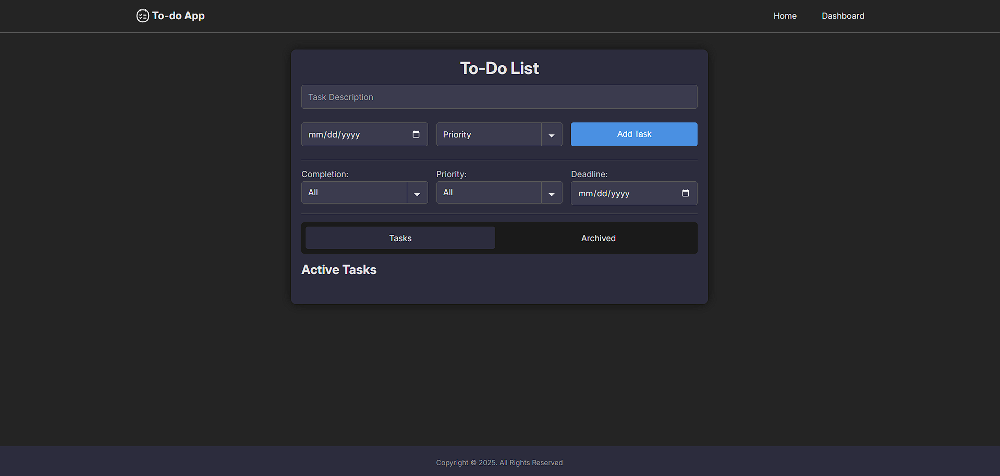
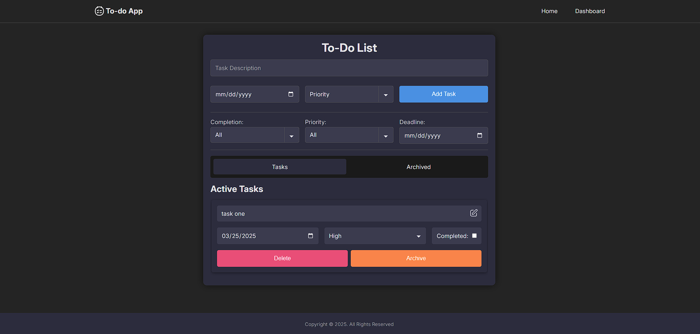
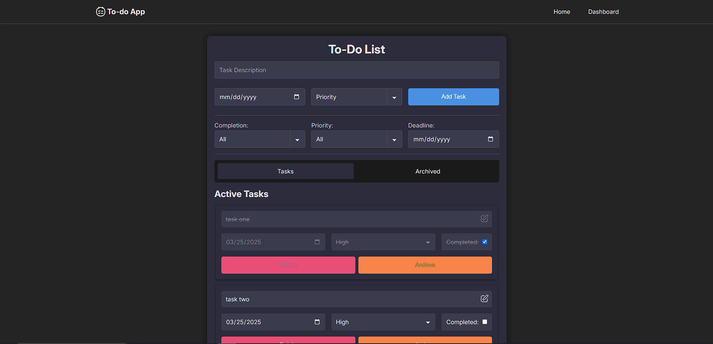
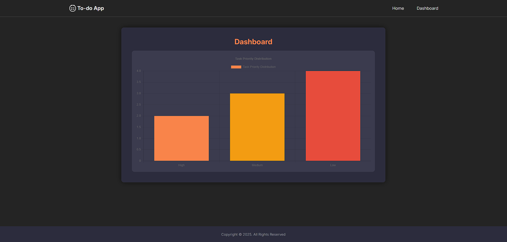

# Todo List App

Creating a Todo List project in React

Features:

- Add Todo Item
- Display Todo List
- Mark Todo as Completed
- Delete Todo Item
- Edit Todo Item
- Filter Todos
- Persist Data
- Due Dates
- Archived Todo Item
<<<<<<< HEAD
=======
- Dashboard

>>>>>>> 4099107f1d5552ec0d6f8d258cd68abdc081a069
